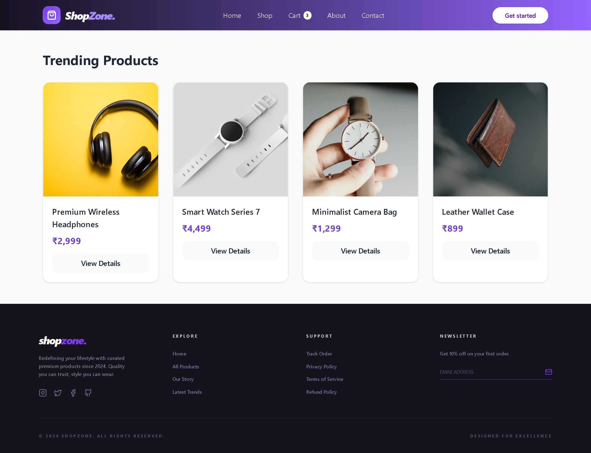

# 🚀 ShopZone - Premium Minimalist E-Commerce Dashboard

ShopZone is a high-performance, minimalist e-commerce application built with **React** and **Tailwind CSS**. The design is inspired by premium storefronts and modern SaaS dashboards, focusing on high-contrast typography, violet-themed aesthetics, and a seamless user experience.

## 📸 Preview



## 📺 Project Demo
[](https://youtu.be/g-faOLoCbYU?si=a6pLVPjEvecpaXYS)

## ✨ Key Features

* **SaaS-Grade UI**: Features a professional layout with high-contrast violet gradients (#7c3aed), spaced-out typography (`tracking-widest`), and a "Bento-style" About page.
* **Persistent Cart Engine**: Integrated with `localStorage` via **Context API** to ensure your shopping cart and user session survive browser refreshes.
* **Protected Checkout Flow**: Advanced routing system that guards the checkout process—redirecting unauthorized users to a custom "Login as Guest" portal.
* **Dynamic Inventory**: Real-time product synchronization using the **DummyJSON API** with built-in loading states and sophisticated error handling.
* **Micro-Interactions**: Polished UI elements including scale-on-hover product cards, backdrop-blur navigation, and smooth transition effects.
* **Fully Responsive**: Optimized for all screen sizes; features a 4-column fluid grid on desktop and a clean stacked mobile view for maximum accessibility.

## 🛠️ Tech Stack

* **React.js**: For component-based architecture and robust state management.
* **Tailwind CSS**: For utility-first styling and a professional high-contrast theme.
* **React Router v6**: For handling dynamic paths, nested routes, and Private Route protection.
* **Context API**: Global state management for both **Authentication** and **Cart Logic**.

## 🚀 Getting Started

### Prerequisites
* Node.js (LTS Version)
* npm or yarn

### Installation

1.  **Clone the repository**:
    ```bash
    git clone [https://github.com/your-username/shopzone.git](https://github.com/technoshiva123/Prodesk-IT-Week-6.git)
    ```

2.  **Install dependencies**:
    ```bash
    npm install
    ```

3.  **Start the development server**:
    ```bash
    npm run dev
    ```

## 📱 Responsiveness
The dashboard is built to adapt seamlessly:
* **Desktop**: Multi-column product grid with persistent floating navigation.
* **Mobile**: Single column stacked view with an optimized mobile menu and condensed typography.

---
**Developed for Week 6 React Project | Focus on Persistence & Auth Logic**
